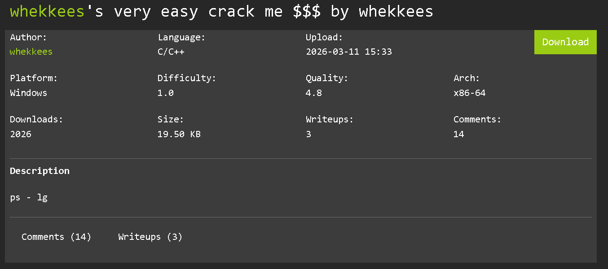
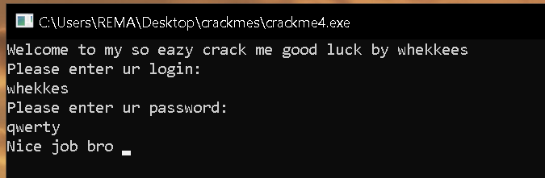

## Crackme description



## Initial Analysis

A quick way to understand the program's purpose is to examine the strings referenced throughout the binary.

Among the discovered strings, the most interesting ones are:

```cpp
FUN_140001630((basic_ostream<> *)cout_exref,
              "Please enter ur login: \n");

FUN_140001630((basic_ostream<> *)cout_exref,
              "Please enter ur password: \n");
```

These messages indicate that the program expects both a username and password from the user. This suggests that the goal of the crackme is to recover the correct credentials required to reach the success path.

## Recovering the Expected Credentials

While examining the decompiled code, we encounter two hardcoded strings:

```cpp
builtin_strncpy(local_70, "whekkes", 8);
builtin_strncpy(local_78, "qwerty", 7);
```

To make the code easier to follow, we can rename these variables:

```cpp
builtin_strncpy(string1, "whekkes", 8);
builtin_strncpy(string2, "qwerty", 7);
```

At this point, we have identified two predefined strings that are likely involved in the credential verification process.

## Username Verification

The program first prompts the user for a username:

```cpp
FUN_140001630((basic_ostream<> *)cout_exref,
              "Please enter ur login: \n");

FUN_140001850((basic_istream<> *)cin_exref,
              (longlong *)&local_48,
              param_3);
```

The second function call is a C++ input operation, indicating that the user's login is being stored in `local_48`.

After renaming the variable:

```cpp
FUN_140001850((basic_istream<> *)cin_exref,
              (longlong *)&username,
              param_3);
```

the intent becomes much clearer.

Immediately afterward, the program performs a comparison:

```cpp
ppppuVar7 = (undefined8 ****)username;

iVar4 = memcmp(ppppuVar7, string1, local_38);
```

Here, the user supplied username is compared against `string1` using `memcmp`.

Since:

```cpp
string1 = "whekkes";
```

we can conclude that the expected username is:

```text
whekkes
```

## Password Verification

After the username check, the program requests a password:

```cpp
FUN_140001630((basic_ostream<> *)cout_exref,
              "Please enter ur password: \n");

FUN_140001850((basic_istream<> *)cin_exref,
              (longlong *)&password,
              sVar6);
```

Once the password is read, another comparison takes place:

```cpp
ppppuVar7 = (undefined8 ****)password;

if ((local_58 == sVar5) &&
   ((local_58 == 0 ||
    (iVar4 = memcmp(ppppuVar7, string2, local_58),
     iVar4 == 0))))
{
    FUN_140001630((basic_ostream<> *)cout_exref,
                  "Nice job bro ");
}
```

The user supplied password is compared against `string2` using `memcmp`.

From the earlier initialization:

```cpp
string2 = "qwerty";
```

we can determine that the expected password is:

```text
qwerty
```

The success message is only printed when this comparison succeeds, confirming that the correct password has been identified.

## Output



From our analysis the recovered credentials are:

`Username: whekkes`
`Password: qwerty`

Using those credentials we were able to successfully solve the crackme as visible in the output screen.