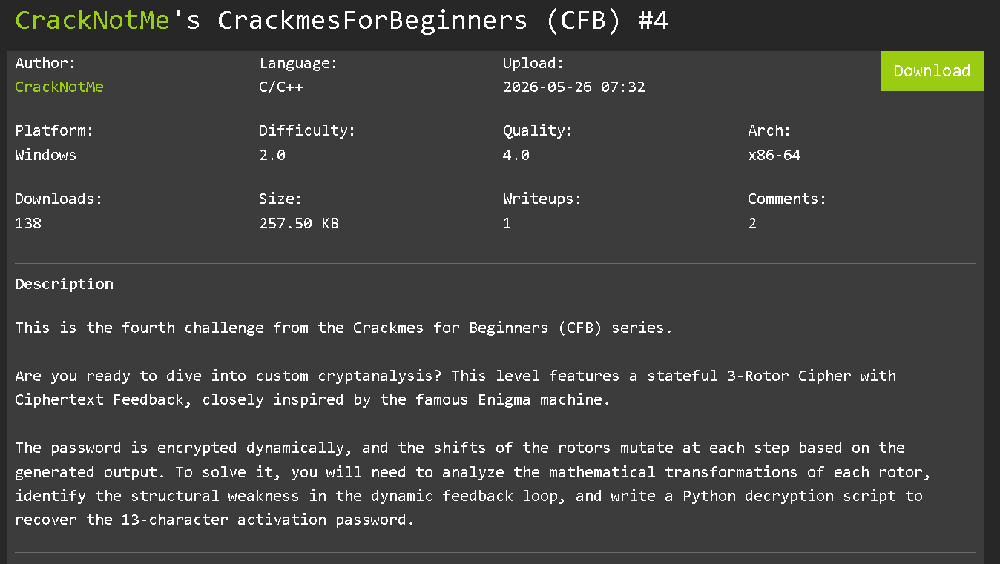
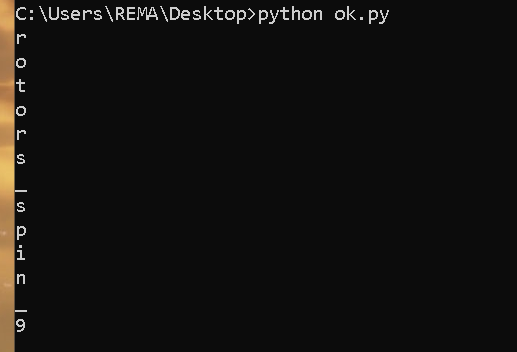
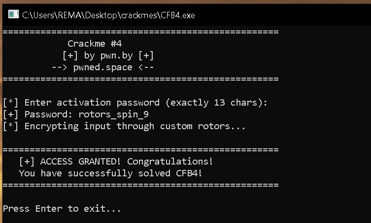

# CrackMe #4 Writeup

## Description



## Initial Analysis

Opening the binary in Ghidra and inspecting the available strings immediately reveals the program banner and several interesting messages:

```cpp
"[*] Enter activation password (exactly 13 chars):"
"[+] Password: "
```

This suggests that the program expects a password of exactly `13` characters.


Running the crackme confirms this behavior. Providing a shorter input such as `test` results in an error message indicating that the password length is invalid.

The corresponding decompiled code contains the following validation:

```cpp
plVar7 = FUN_140001220(&DAT_14003f600,"[-] Error: Password must be exactly ");
plVar7 = FUN_140003300(plVar7,0xd);
FUN_140001220(plVar7," characters long!\n");
```

Since `0xD` equals `13`, the length requirement is enforced before any password verification logic is executed.

---

## Locating the Verification Routine

Supplying a `13`-character input causes the program to display a message indicating that the password is being encrypted through custom rotors.

Further analysis in Ghidra reveals a large block of arithmetic operations followed by a final conditional check:

```cpp
if (...)
{
    pcVar24 = "   You have successfully solved CFB4!              \n";
    pcVar21 = "   [+] ACCESS GRANTED! Congratulations!            \n";
}
else
{
    pcVar24 = "   Keep reversing and try again!                   \n";
    pcVar21 = "   [-] ACCESS DENIED! Invalid password.            \n";
}
```

This indicates that the transformed input bytes are compared against a series of hardcoded values. If every comparison succeeds, access is granted.

Rather than attempting to understand the entire decompiled function immediately, dynamic analysis in `x64dbg` provides a much clearer view of the verification process.

---

## First Character Analysis

Using the test input:

```text
testtesttestt
```

and tracing execution in `x64dbg`, the first character is loaded and processed through the following sequence:

```asm
movzx r9d, byte ptr [rax]
add   r9b, 5
xor   r9b, 0x3A
add   r9b, 0x13
xor   r9b, 0x7F
sub   r9b, 0x0D
xor   r9b, 0x5C
add   r9b, 0x15
xor   r9b, 0xA5
cmp   r9b, 0xC6
```

The first character of our test input is `t`.

After all transformations, the resulting value becomes `0xF0`, which fails the comparison against the expected value `0xC6`.

Since every operation is reversible, we can recover the correct input character by applying the inverse operations in reverse order.

```python
num = 0xC6

x = num ^ 0xA5
x = x - 0x15
x = x ^ 0x5C
x = x + 0x0D
x = x ^ 0x7F
x = x - 0x13
x = x ^ 0x3A
x = x - 0x05

print(chr(x))
```

Output:

```text
r
```

Verifying this result in `x64dbg` confirms that the character `r` is transformed into the expected value:

```asm
cmp r9b, 0xC6
```

Register state:

```text
R9  = 0xC6
RAX = "rtesttesttest"
```

The first character of the password is therefore:

```text
r
```

---

## Understanding the Rotor Logic

Continuing through the verification routine reveals that the remaining characters are processed using similar arithmetic transformations.

However, there is an important difference.

The transformation applied to each character is not identical. Several values used during the calculations depend on the results of previous characters through registers such as `R11B`, `R10B`, `CL`, and `R8B`.

As a result:

* The same input character can produce different outputs depending on its position.
* The transformation behaves similarly to a rotor-based encryption system.
* Simple brute forcing becomes significantly more difficult.

Counting the comparison instructions reveals exactly `13` validation checks, matching the required password length of `13` characters.

This confirms that each character is individually transformed and validated against a corresponding hardcoded value.

The target values are:

```text
0xC6
0xB7
0x2B
0x6E
0x9E
0xB7
0xFA
0x54
0x52
0x3F
0x35
0x98
0xDF
```

---

## Recovering the Remaining Characters

To avoid manually reversing every transformation in the debugger, a Python script was written to perform the inverse operations for all thirteen validation stages.

The script uses the hardcoded comparison values together with the intermediate register values observed during execution.

```python
r11 = 0xCB    
second = 0xB7    

second ^= 0xA5
second = (second - 0x15) & 0xFF
second ^= 0x5C
second = (second +  r11) & 0xFF
second ^= 0x7F
second = (second - 0x13) & 0xFF
second ^= 0x3A 
second = (second - r11) & 0xFF

print(chr(second))
```
Here we can dupliacate this code block and replace the valye of target value(second) and register value according to the assembly instructions and get the output.



Running the script produces:

```text
rotors_spin_9
```

This appears to be the correct activation password.

---

## Verification


Entering the recovered password into the crackme causes every comparison check to succeed.

## Conclusion

This crackme implements a custom rotor-inspired encryption scheme where each character influences subsequent transformations. Although the verification logic initially appears complex, dynamic analysis in `x64dbg` reveals that each stage ultimately compares the transformed character against a hardcoded target value.

By reversing the arithmetic operations and automating the process with a Python script, the correct password was recovered as:

```text
rotors_spin_9
```
