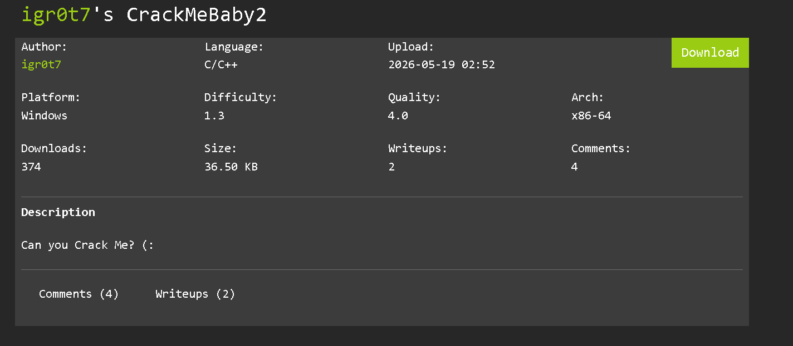
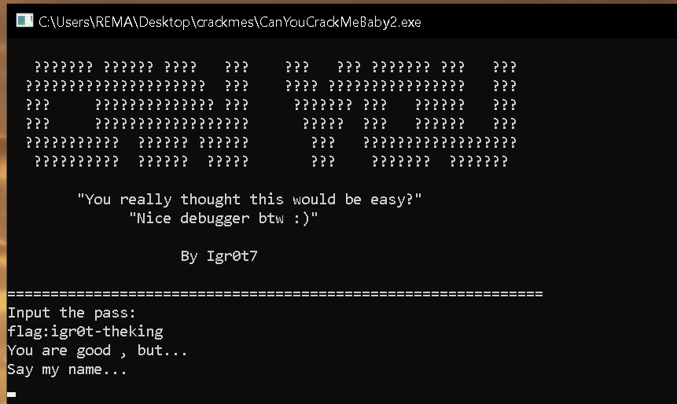
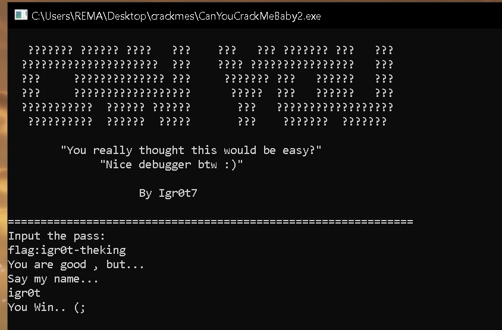

## Description



## Anti-Debug Check

At the beginning of execution, the program performs an anti-debugging check:

```cpp
local_30 = DAT_14000a040 ^ (ulonglong)auStackY_168;

uVar3 = FUN_140001750();

if ((char)uVar3 != '\0') {
    MessageBoxA(
        (HWND)0x0,
        "Debugger detected! Bye (:",
        "Anti-Debug",
        0x10);

    ExitProcess(0);
}
```

The function `FUN_140001750()` returns a non-zero value when a debugger is detected. If this occurs, the program displays a message box and immediately terminates.

The corresponding assembly confirms this behavior:

```asm
call canyoucrackmebaby2.7FF7B6581750
test al,al
je canyoucrackmebaby2.7FF7B6581BA3

...

call qword ptr ds:[ExitProcess]
```

The return value of the debugger check is stored in `AL` and tested using `test al, al`.

If the return value is zero, execution continues normally. Otherwise, the program reaches the termination path and calls `ExitProcess`.

To analyze the crackme under a debugger, the conditional jump can be patched to bypass the anti-debug check.

```asm
call canyoucrackmebaby2.7FF7B6581750
test al,al
jnz canyoucrackmebaby2.7FF7B6581BA3
```

After patching the jump, execution continues even when a debugger is attached.

## Identifying a Fake Password Check

While inspecting the binary, two hardcoded strings stand out:

```cpp
builtin_strncpy(_Buf2,"flag{can-you-crack?}",0x15);
builtin_strncpy(local_b0,"Access Denied...\n",0x12);
```

At first glance, these strings appear important, especially the flag-like value. However, further analysis reveals that this portion of the program is intended to mislead the user.

The crackme then requests a password:

```cpp
FUN_140002430(
    (basic_ostream<> *)cout_exref,
    "Input the pass:\n");

FUN_140002610(
    (basic_istream<> *)cin_exref,
    (longlong *)&local_d0,
    param_3);
```

After renaming variables:

```cpp
FUN_140002610(
    (basic_istream<> *)cin_exref,
    (longlong *)&password,
    param_3);
```

the comparison becomes easier to understand:

```cpp
pppppppuVar9 = &password;

if ((local_c0 == 0x14) &&
   (iVar2 = memcmp(pppppppuVar9,_Buf2,0x14),
    iVar2 == 0))
{
    ...
}
```


The program appears to expect a password with a length of `0x14` bytes. However, dynamic analysis shows that satisfying this comparison only leads into a long execution path that eventually terminates the program.

This indicates that the check is intentionally designed as a decoy.

By following the alternative execution path, another password comparison becomes visible.

## Recovering the Real Password

Further analysis reveals a second comparison:

```cpp
if ((uVar7 == 0x12) &&
   (iVar2 = memcmp(puVar5,_Buf2_00,0x12),
    iVar2 == 0))
{
    FUN_140002430(
        (basic_ostream<> *)cout_exref,
        "You are good , but...\n");

    FUN_140002430(
        (basic_ostream<> *)cout_exref,
        "Say my name...");
}
```

Unlike the previous check, this one leads to additional program functionality, indicating that it is the actual validation logic.

To understand the comparison, a test string was supplied and execution was traced into the `memcmp` call:

```asm
mov r8,rdi
mov rdx,r15
call memcmp
```

According to the Windows x64 calling convention:

```text
RCX = First argument
RDX = Second argument
R8  = Third argument
R9  = Fourth argument
```

At the comparison point:

```text
RDX = "lfkm0cmx:~'~boacdm"
RCX = "~oy~~oy~~oy~~oy~~o"
R8  = 0x12
```

The value stored in `RCX` was generated from the supplied test input. Observing the pattern suggests that every character of the input has been transformed before comparison.

Tracing backward reveals the responsible loop:

```asm
xor byte ptr [rax+rcx],Ah
inc rcx
cmp rcx,rdi
jb ...
```

The program iterates through the input string and XORs each character with the key `'A'`.

In pseudocode:

```c
for (i = 0; i < length; i++) {
    input[i] ^= 'A';
}
```

Because XOR is reversible, applying the same operation to the target string recovers the original password.

```text
Encrypted: lfkm0cmx:~'~boacdm
Key:       A
```

XORing the encrypted string with `'A'` produces:

```text
flag:igr0t-theking
```

This is the correct password required to pass the real validation routine.



## Recovering the Final Input

After providing the correct password, the program proceeds to a second challenge:

```cpp
FUN_140002430(
    (basic_ostream<> *)cout_exref,
    "You are good , but...\n");

FUN_140002430(
    (basic_ostream<> *)cout_exref,
    "Say my name...");

FUN_140002610(
    (basic_istream<> *)cin_exref,
    (longlong *)&local_90,
    uVar7);
```

Renaming `local_90` improves readability:

```cpp
FUN_140002610(
    (basic_istream<> *)cin_exref,
    (longlong *)&name,
    uVar7);
```

The supplied value is later compared against a five-character string:

```cpp
pppppppuVar10 = name;

if ((local_80 == 5) &&
   (iVar2 = memcmp(pppppppuVar10,&local_130,5),
    iVar2 == 0))
{
    FUN_140002430(
        (basic_ostream<> *)cout_exref,
        "You Win.. (;");
}
```

To determine the expected value, execution was traced into the `memcmp` call.

At the comparison point:

```text
RCX = "teste"
RDX = "igr0t"
R8  = 5
```

Since `RDX` contains the hardcoded comparison string and a successful match leads directly to the victory message, the expected input is:

```text
igr0t
```

## Solution

The crackme contains several layers intended to mislead the analyst:

1. An anti-debugging check.
2. A fake password validation routine.
3. An XOR-obfuscated password.
4. A final name verification step.

The required inputs are:

```text
Password: flag:igr0t-theking
Name:       
```

Providing both values successfully reaches the final success message:

```text
You Win.. (;
```
